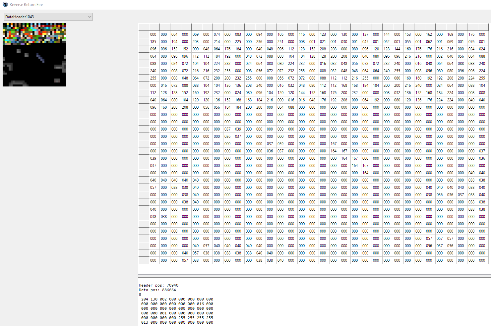

# Return Fire file format fun

[Return Fire](https://en.wikipedia.org/wiki/Return_Fire) is a game I've only ever played the demo of, from a cover-CD of an old gaming magazine.
I loved the concept of having 4 different vehicles with completely different handling and approaches to the battlefield, but I could never afford to buy it.

Now instead of playing it, I'm deriving a bunch of joy just from statically analysing its file formats, the Windows version in particular here.

This is all incomplete and possible wrong information, but dumping it here in case anyone finds it useful.

## File formats

### Simple formats

`Sound\*.SDT` are just `.WAV` files

`Art\trans.tbl` is the palette conversion data.
While I made some progress with this file, I found it _way_ easier to:

- play the demo on Windows 98 in 256 colour mode
- take a screenshot
- rip the palette data out of the resulting screenshot BMP

`Art\*.RFA` are just `.BMP` files

### More involved formats

[Art\ART.CAR](./ART.CAR/) contains textures and sprites

[*.RFM](./RFM/) contains level information

### Meshes

I've not yet figured out where these are hiding, but there are certain sprites that have "noise" at the start of them.
The values of these pixels are suspiciously numerically close to each other, and suspiciously on images that are textures on some meshes.
Could be a rabid wild goose chase, could be indices, not sure yet.

